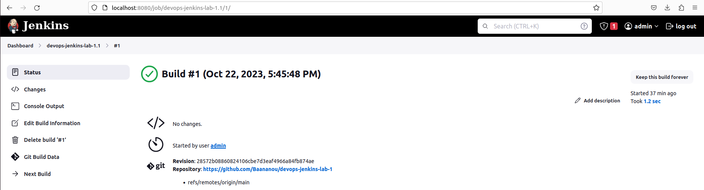
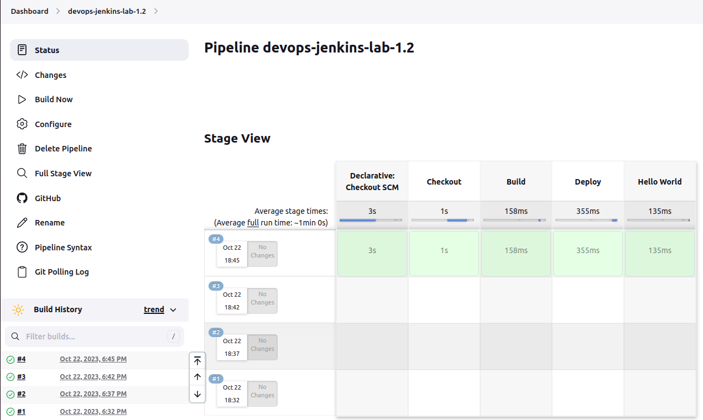

# devops-jenkins-lab-1
## Conclusion - Part 1: FreeStyle Project

In this section, we successfully created and configured a FreeStyle project in Jenkins. By implementing source code management, scheduling regular SCM checks, and using shell commands with `echo` for progress tracking, we established a basic CI pipeline. This approach is suitable for simpler projects that don't require complex workflows.

---

## Conclusion - Part 2: Pipeline Project

The Pipeline project in Jenkins provides a more flexible and scalable approach to continuous integration. By defining build steps within a Jenkinsfile, we can achieve fine-grained control over the CI process. Unlike FreeStyle projects, we don't rely on scheduled SCM polling. This approach is well-suited for more complex projects that demand a higher degree of automation and customization.

